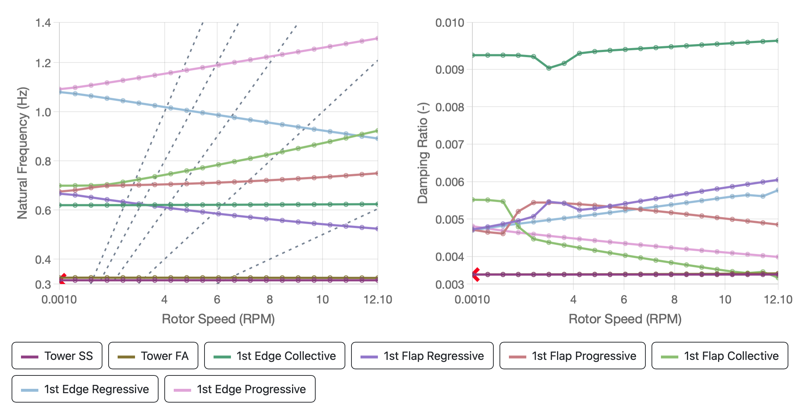

The goal of `ACDC` is to simplify the process of generating Campbell diagrams for wind turbines modeled in OpenFAST. `ACDC` automates the preparation of existing OpenFAST models (input files) to perform linearization across a range of operating conditions. It then post-processes the OpenFAST output files to generate Campbell diagrams and visualize the mode shapes.

## What is OpenFAST

[OpenFAST](https://openfast.readthedocs.io/) is a multi-physics, multi-fidelity tool for simulating the coupled dynamic response of wind turbines. OpenFAST is able to model a range of wind turbine configurations, including two-bladed and three-blade horizontal-axis rotor, rigid or teetering hub, upwind or downwind rotor, and lattice or tubular tower. The wind turbine can be on land, or offshore on fixed-bottom or floating substructures.

## What is a Campbell Diagram?

Campbell diagrams are essential tools in the analysis and design of rotating machinery, including wind turbines. They provide a graphical representation of the relationship between the rotational speed of the machine and its natural frequencies. An example structure-only Campbell Diagram for the NREL 5MW turbine is shown below. 

Here’s a detailed description of how Campbell diagrams relate to wind turbines:

### Purpose and Importance

- **Vibration Analysis**: Campbell diagrams help in identifying critical speeds at which resonances might occur, leading to excessive vibrations. In wind turbines, managing these vibrations is crucial to ensure the structural integrity and longevity of the components.

- **Avoidance of Resonance**: By mapping the natural frequencies against operational speeds, designers can avoid configurations where the natural frequencies coincide with the harmonic frequencies of the rotating components. This helps prevent resonance conditions that could cause damage.

### Structure of Campbell diagrams

- **Axes**: The horizontal axis represents the rotational speed of the wind turbine (usually in revolutions per minute or RPM). The vertical axis represents the frequency of vibrations (usually in Hertz or Hz).

- **Frequency Lines**: Natural frequencies of the system are plotted as horizontal lines. Harmonic frequencies, which are multiples of the rotational speed, are plotted as diagonal lines (slope depends on the harmonic number).

### Interpretation

- **Intersection Points**: The points where diagonal lines (representing harmonic frequencies) intersect horizontal lines (representing natural frequencies) are critical. These intersections indicate potential resonance conditions.

- **Critical Speeds**: The rotational speeds at which these intersections occur are known as critical speeds. Wind turbine operations should avoid these speeds to prevent resonance.

### Application in Wind Turbines

- **Blade Dynamics**: Wind turbine blades are subject to complex aerodynamic forces. Campbell diagrams help in understanding the dynamic behavior of the blades and ensuring that the operational speeds do not coincide with the blade's natural frequencies.

- **Tower and Nacelle**: The Campbell diagram can also include the natural frequencies of the tower and nacelle. Resonance in these structures can lead to severe operational issues or even catastrophic failure.

- **Design and Testing**: During the design phase, engineers use Campbell diagrams to fine-tune the design of blades, tower, and nacelle to ensure safe operational ranges. In testing and validation, Campbell diagrams help in verifying that the actual natural frequencies match the designed values and that no unexpected resonances occur.

Campbell diagrams are crucial in the wind turbine industry for ensuring that turbines operate safely and efficiently. By providing a clear visual representation of the relationship between rotational speed and natural frequencies, they help engineers design turbines that avoid resonance, thereby enhancing performance and reliability.

## Use Cases

The primary use case for `ACDC` is prepare OpenFAST input files to perform linearization and post-process the results to generate Campbell diagrams. However, `ACDC` can also be used to generate Campbell diagrams from user generated linearization files by browsing for the folder containing those files in the `Results` tab (see [Linearization Folder]() for details).

In addition, `ACDC` can visual the turbine mode shapes as described in [Mode Visualization]().

