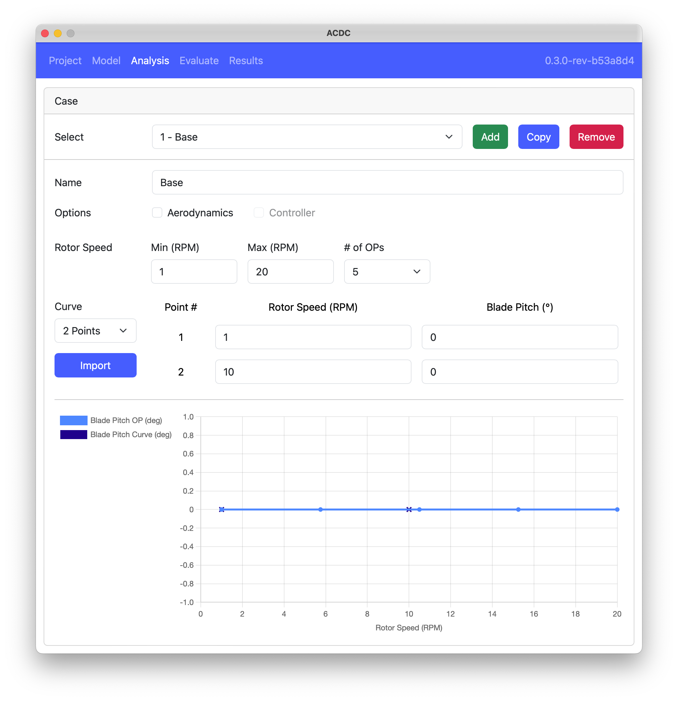
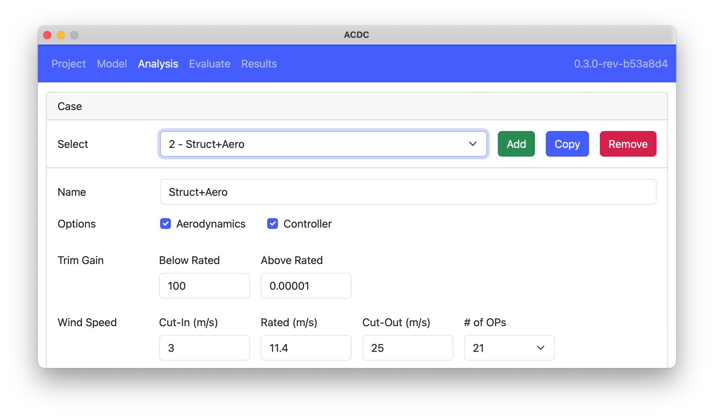
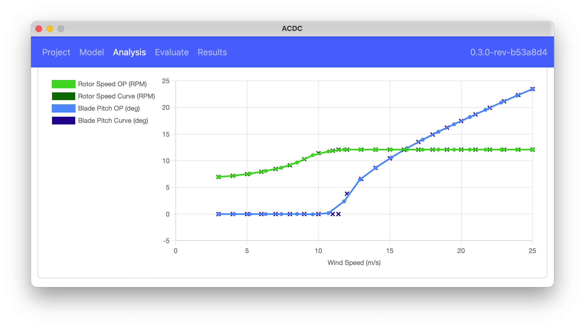

The `Analysis` tab is where the user defines the operating points for the analysis. Multiple sets of operating points, or `Cases`, can be defined for the same model. `Cases` may include aerodynamic effects and a controller may be used adjust the pitch and torque to achieve steady state. Depending on if the `Aerodynamics` and `Controller` options are selected, the interface will include additional inputs for wind speed, trim gain, and rated wind speed. The following figure shows the interface for a `Case` without aerodynamics.

### Operating Points

For the case without aerodynamics, the operating points are defined by the number of points between a minimum and maximum rotor speed in RPMs. For the case with aerodynamics, the operating points are defined by an evenly spaced number of wind speeds between cut-in and cut-out. The rated wind speed is used to determine at which operating points to apply the controller 

### Curve

The `Curve` defines the relationship between `Rotor Speed` and `Blade Pitch` (no aerodynamics) or between `Wind Speed`, `Rotor Speed`, and `Blade Pitch` (with aerodynamics). The curve can be multiple points and the operating points at which the linearization is performed is calculated from this curve via spline interpolation. The curve may be imported from a CSV file by clicking the `Import` button. The file must have three columns:

1. Wind Speed
1. Rotor Speed
1. Blade Pitch

and comment rows may start with a `#`. For the structural case, the `Wind Speed` column is ignored. The `Curve` is plotted as shown in the following figure where the curve points are shown with `x` and the operating points are shown with lines and `o`.

