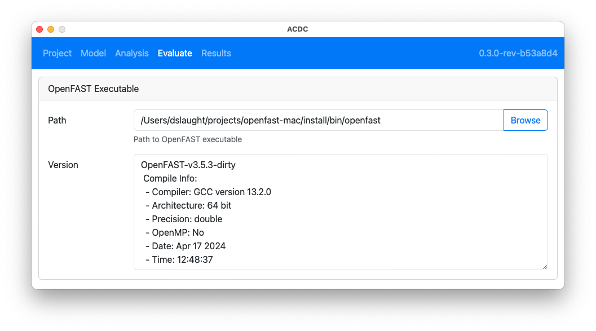

The `Evaluate` tab runs a case to generate linearization files at each operating point. 

### OpenFAST Executable

The first step in performing an evaluation is to select the OpenFAST executable by clicking the `Browse` button as shown in the following figure. This action opens a dialog box to select the path to the executable. The dialog will default to the path of `openfast` in the system's path, if one is found.

### Evaluate Case

The `Evaluate Case` card allows the user to evaluate the operating points in the selected case. The following figure shows the options:

- Select Case: the analysis case for which the operating points will be evaluated
- CPUs: the number of instances of OpenFAST to run in parallel to evaluate the operating points

Clicking the `Start` button will launch OpenFAST to run each operating point. Clicking the `Cancel` button will stop any running operating point evaluations.

#### Operating Point Evaluations

Each operating point is simulated using OpenFAST. Evaluations can have the following states:

- Queued - waiting to run
- Simulation - performing time-domain simulation to reach steady state
- Linearization - linearizing the model at 1 or more points through a full rotor revolution
- Complete - evaluation has completed successfully
- Canceled - evaluation was canceled before completion
- Error - OpenFAST encountered an error and aborted the evaluation

All evaluations are terminated if OpenFAST encounters any errors. The dark blue progress bar indicates simulation progress with regards to the final time, `TMax`. The light blue progress bar indicates linearization progress which is based `NLinTimes`. 

The following image shows the status when an error has occurred.

Clicking the `Log` button next to an operating point evaluation will display the output from OpenFAST as shown below.

