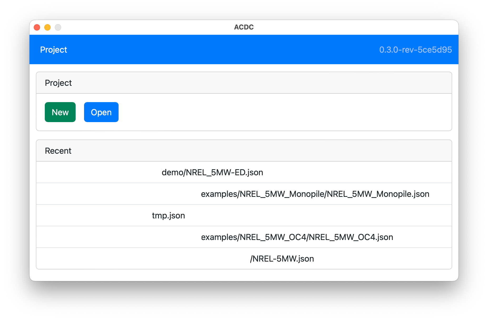

ACDC executables are released for Windows, MacOS, and Linux, which can be downloaded from the project's [Github Releases](https://github.com/openfast/acdc/releases). It may also be compiled from source using [WAILS](https://wails.io/) after following its [Installation Instructions](https://wails.io/docs/gettingstarted/installation). 

### Install OpenFAST

ACDC uses OpenFAST to run the turbine simulations and perform the linearization so a working installation of OpenFAST is needed. For detailed installation instructions, please refer to [https://openfast.readthedocs.io](https://openfast.readthedocs.io/en/main/source/install/index.html). Linearization works best when OpenFAST is compiled with the `DOUBLE_PRECISION=ON` option.

### Test OpenFAST Installation

Running the command `openfast` in a terminal will produce output similar to the following:

```
**************************************************************************************************
 OpenFAST

 Copyright (C) 2024 National Renewable Energy Laboratory
 Copyright (C) 2024 Envision Energy USA LTD

 This program is licensed under Apache License Version 2.0 and comes with ABSOLUTELY NO WARRANTY.
 See the "LICENSE" file distributed with this software for details.
 **************************************************************************************************

 OpenFAST-v3.5.3-dirty
 Compile Info:
  - Compiler: GCC version 13.2.0
  - Architecture: 64 bit
  - Precision: double
  - OpenMP: No
  - Date: Apr 17 2024
  - Time: 12:48:37
 Execution Info:
  - Date: 05/14/2024
  - Time: 11:03:46-0400


  Syntax is:

     OpenFAST [-h] <InputFile>

  where:

     -h generates this help message.
     <InputFile> is the name of the required primary input file.

  Note: values enclosed in square brackets [] are optional. Do not enter the brackets.

  Invalid syntax: no command-line arguments given.

  Aborting OpenFAST.
```

### Run ACDC

Start `ACDC` by running the executable downloaded from Github. MacOS users may need to right-click on `ACDC.app` and select `Open` and then click `Open` on the dialog that is displayed because the application is not signed. `ACDC` will start and display the `Project` page as shown below (recent file paths have been removed):


