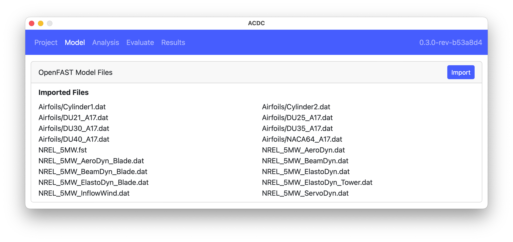
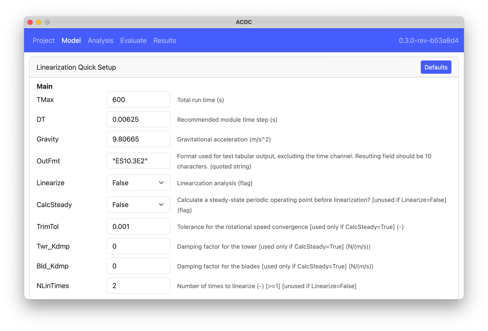
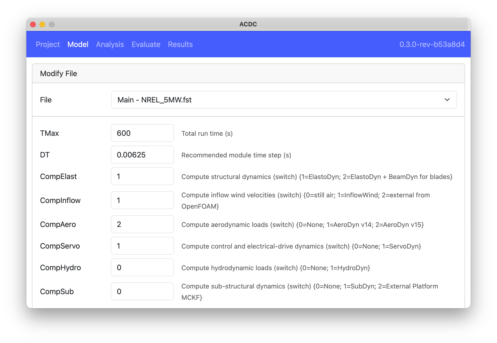

The `Model` tab handles importing and modifying OpenFAST turbine models. The following figure shows the `Model` tab before a model has been imported. The `Import` button opens a dialog for the user to select the main `.fst` file of an OpenFAST model. The main file and all referenced files are read and stored in the `Project` file. Fields relevant to performing linearization are also extracted and made available for user modification inside `ACDC`.

After a model is imported, the list of OpenFAST files that were read are presented, as shown below. Note: once the OpenFAST model is imported, the original files are not used and changes to those files will not affect the model in `ACDC`

Below the list of imported files is the `Linearization Quick Setup` card which contains the main OpenFAST fields relevant to linearization, see the following figure. Clicking the `Defaults` button applies predefined linearization settings to the model to aid the user. Not all defaults are applicable to all models and the user should review these settings for their specific model.

The `Modify File` card is located below 1Linearization Quick Setup`, and lets the user modify any of the fields parsed from the OpenFAST input files. This functionality can be used to tune the model if there are issues with the linearization or to study the design. 

