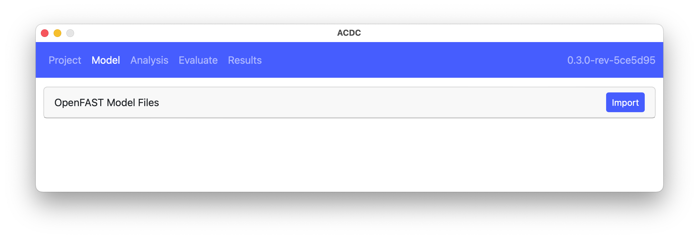

The `Model` section of the ACDC application handles importing and modifying OpenFAST turbine models. The following figure shows the `Model` section before a model has been imported. The `Import` button opens a dialog for the user to select the main `.fst` file of an OpenFAST model. The main file and all referenced files are read and stored in the `Project` file. Fields relevant to performing linearization are also extracted and made available for user modification inside `ACDC`.

After a model is imported, the list of OpenFAST files that were read are presented, as shown below. Note: once the OpenFAST model is imported, the original files are not used and changes to those files will not affect the model in `ACDC`

Below the list of imported files is the Linearization Quick Setup subsection which contains the main OpenFAST fields relevant to linearization, see Figure 5. Clicking the Defaults button applies predefined 