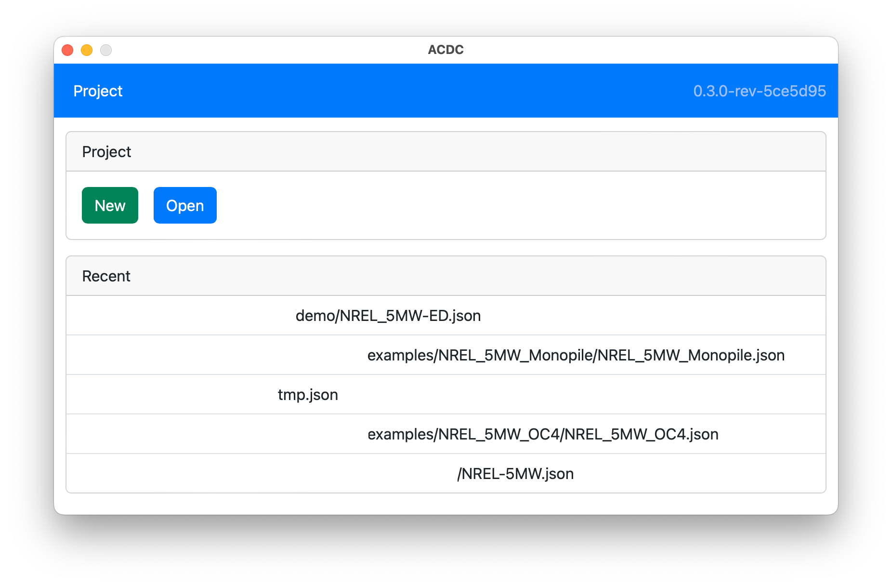
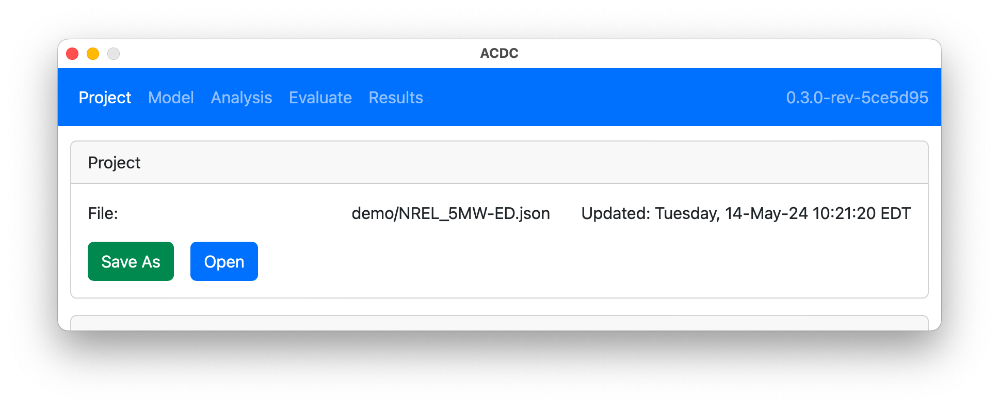

The `Project` tab handles creating and opening project files which contain the data for building the OpenFAST models, setting up linearization, describing the analysis operating points, and running the simulations. The following figure shows the `ACDC` application when it is first started, and without a project loaded. It presents the options to create a new project, which opens a dialog to save a new project file, or to open an existing project, which opens a dialog to select the project file. A list of recently opened projects is also provided which will load the project file at the given path (full paths removed). 

The next figure shows the `Project` tab after a project has been loaded and displays the current project path and the last time the project was updated. Once a project is created or opened, the menu bar changes to display the other sections of the application.

