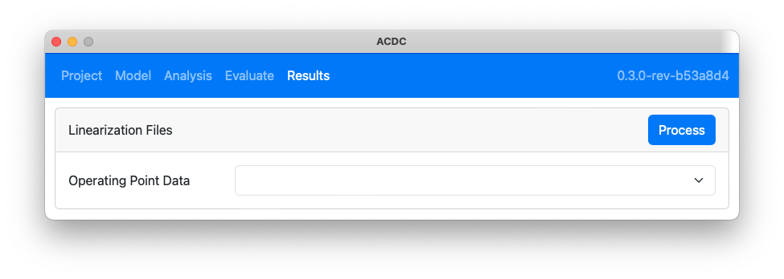

The `Results` tab is used process OpenFAST linearization files to generate the Campbell Diagram and visualize the turbine mode shapes.

## Linearization Folder

The first step in processing the results is to select the directory which contains the linearization files from OpenFAST. These files can have been been generated by running an evaluation in `ACDC` from the `Evaluate` tab, or generated outside `ACDC` by a user's custom workflow. For files generated by `ACDC` click the button corresponding to the case to be loaded; otherwise, click the `Browse` button to open a dialog for selecting a custom folder.

If the folder contains results (`results.json`) or a Campbell Diagram (`diagram.json`) from previous processing, they will be automatically loaded by `ACDC`. However, if new linearization files have been created since previous processing ocurred, the new files will need to be processed through the steps below.

## Linearization Files

Once the linearization folder has been selected, the files can be processed by clicking the `Process` button in the `Linearization Files` card as shown below. Linearization processing performs the following steps:

- Loads the linearization files for each operating point
- Performs the Multi-Blade Coordinate Transform (MBC) to average the blade response over multiple azimuth angles
- Perform the Eigenanalysis of the averaged state matrix to get frequencies and mode shapes

With the processing complete, the user can view the frequency and damping data by selecting an operating point from the dropdown as shown below.

## Campbell Diagram

The Campbell Diagram is created by clicking the `Generate` button on the `Campbell Diagram` card as shown in the following image. There are several options that can be customized when generating the Campbell Diagram:

- Minimum Frequency: modes with natural frequencies below this value will not appear in the diagram
- Maximum Frequency: modes with natural frequencies above this value will not appear in the diagram
- [Spectral Clustering](): use  of each mode's Eigenvectors to reconfigure lines where the mode shape transitions between operating points (slow for large numbers of cross lines)
- Filter Non-structural Modes: use he location of the maximum value of the mode's eigenvector to determine the dominant state name; remove modes where that state is not in ElastoDyn, BeamDyn, or SubDyn

The diagram is displayed below the generation options as shown in the following figure. This may take several seconds if there are many degrees of freedom in the model, or if Spectral Clustering is enabled for a large number of lines.

With the diagram generated, there is now a new button (`Export Data (.json)`) to export the diagram data a JSON file. Also, a message appears next to the `Generate` button warning the user that regenerating the diagram will replace the current diagram, and the user will loose any changes.

Clicking on a point on the Campbell Diagram or clicking on a line button below it, will allow the user to edit the diagram as shown in the figure below and described in the following two sections.

### Line

The `Line` card has inputs for the user to change the line label and color. These changes are reflected in the Campbell Diagram and line button text. This card also provides a dropdown to select any points (operating points) along this line. The user may also click the `Visualize Line Modes` button to load mode visualizations for all operating points along this line. The line may be hidden from the diagram by clicking the `Hide` button, which also moves the associate line button to the `Hidden` row below the diagram. The line may be restored by clicking the `Show` button on a hidden line.

### Mode

The `Mode` card displays information about the selected operating point for this line. This mode is selected from the Campbell Diagram or by the `Select Point` dropdown on the `Line` card. The `Visualization Scale` dropdown offers several factors which are used to scale the amplitude of the mode shape during visualization. Scale factors of 20 or 50 are reasonable initial guesses. Generally, the higher the frequency of the mode, the larger the scaling factor required to see the motion.

The `Select line to swap mode` feature is experimental. It allows the user to swap the currently selected mode and all subsequent modes from the current line with the corresponding modes in a different line. The following example demonstrates the concept

1. Select the point to swap

2. Select the line to swap subsequent points to and click the `Swap` button

3. Observe that the remaining points have been swapped between lines

## Mode Visualization

`ACDC` uses the VTK files output by OpenFAST for visualization, so the associated checkpoint files are required. These files are automatically generated when `ACDC` evaluates the operating points. Additionally, only components which are represented by a line mesh can be visualized currently.

To visualize a mode shape, click the `Visualize` button on the `Mode` card or the `Visualize Line Modes` on the `Line` card. The amplitude of the mode shape is scaled by the factor selected in the `Visualization Scale` dropdown on the `Mode` card. The `Mode Visualization` card will appear and display a top, front, right-side, and isometric view of the turbine components as shown below.

The white lines are the blades and tower. The colored lines are the paths that the nodes travel through during the animation. The color, from blue to yellow, is based on the length of the path, with longer paths being a brighter color. The display of the node paths can be toggled by clicking the `Hide Node Paths` button.

The `Clear` button is used to clear modes that have been visualized. Below the `Clear` and `Hide Node Paths` buttons is a list of buttons indicating which line and operating point is being visualized. Each time the `Visualize` button is clicked, a new line-operating-point button appears. The user can select which mode to visualize by clicking these buttons. 