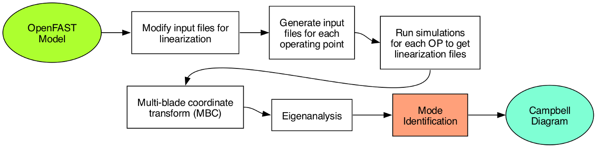
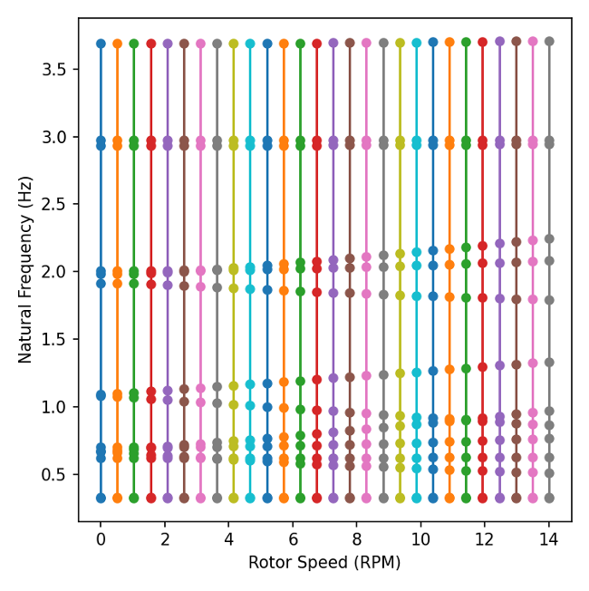
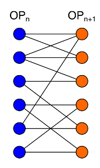
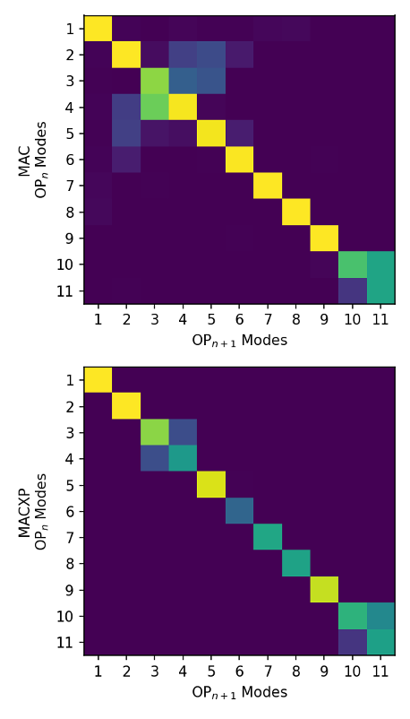
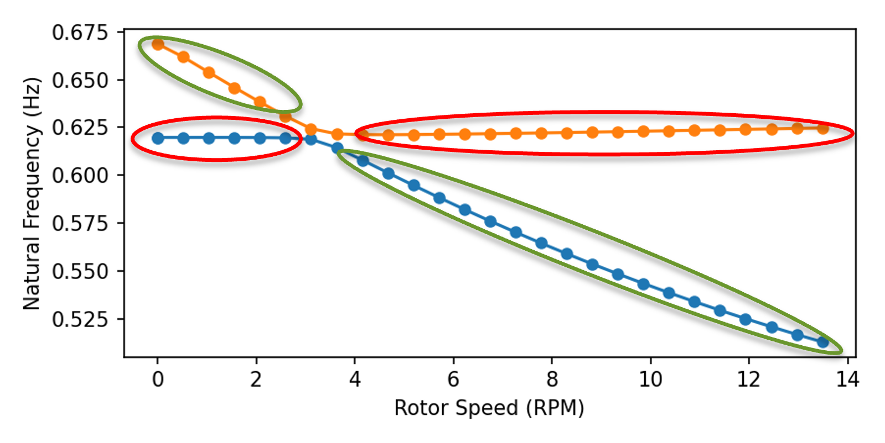
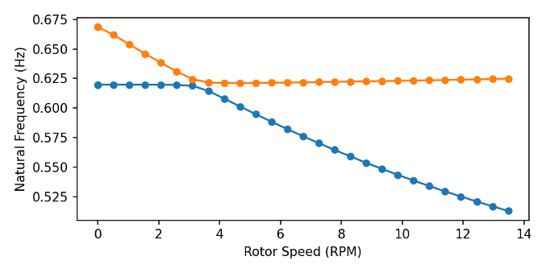
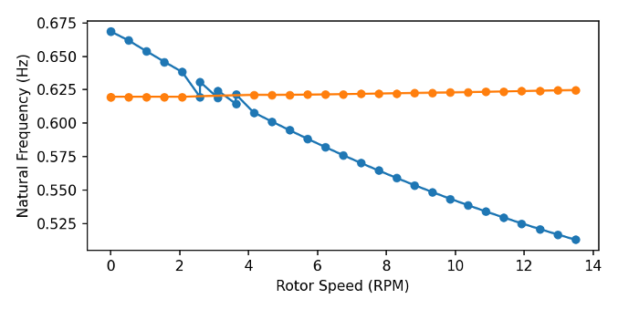

This page describes the Campbell diagram generation workflow and its theoretical background.

## Overview

A Campbell diagram is a powerful visualization tool used in wind turbine analysis to understand how natural frequencies and damping ratios vary with rotor and wind speeds. It helps identify potential resonance conditions and instabilities where structural modes may be excited by harmonic frequencies, which is critical for avoiding fatigue damage and ensuring safe operation.

Campbell diagram generation with OpenFAST follows a systematic automated workflow consisting of five main steps:

1. **Import OpenFAST Model** - Analyze the turbine to get time domain and linearization data
2. **Define Operating Points** - Specify rotor speeds and other operating conditions for linearization
3. **Run Simulations** - Execute OpenFAST linearization at each operating point
4. **Multi-Blade Coordinate (MBC) Transformation** - Transform rotating blade coordinates to fixed reference frame
5. **Eigenanalysis and Mode Identification** - Extract natural frequencies and mode shapes, then track modes across operating points

## Multi-Blade Coordinate (MBC) Transformation

For wind turbines with multiple blades, the dynamics in the rotating reference frame are periodic and coupled due to rotor rotation. The Multi-Blade Coordinate transformation converts the rotating blade degrees of freedom into a fixed (non-rotating) reference frame, producing:

- **Collective modes** - All blades move in phase (symmetric motion)
- **Cyclic modes** - Blades move with phase differences (asymmetric motion)
- **Fixed-frame representation** - Time-invariant system matrices suitable for eigenanalysis

This transformation is essential because it:
- Decouples the periodic equations of motion into time-invariant form
- Enables conventional eigenanalysis techniques
- Separates symmetric and asymmetric rotor modes
- Simplifies the identification of structural modes

The MBC transformation yields state-space matrices in the fixed reference frame, which can then be analyzed using standard linear algebra techniques.

## Eigenanalysis

Eigenanalysis is a mathematical technique that decomposes a linear system into its fundamental components: eigenvalues and eigenvectors.

- **Eigenvalues** - Complex numbers representing natural frequencies and damping ratios of the system modes
- **Eigenvectors** - Complex vectors describing the mode shapes, indicating how different degrees of freedom participate in each mode

For wind turbine analysis, eigenanalysis of the MBC-transformed system provides:
- Natural frequencies at each operating point
- Mode shapes that characterize the physical motion (e.g., tower bending, blade flap/edge, drivetrain torsion)
- Damping characteristics indicating stability of each mode

The eigenvalues are typically plotted against rotor speed to create the Campbell diagram, with rotational harmonic lines overlaid to identify potential resonances.

## Mode Identification

Mode identification is the process of tracking the same physical mode across different operating points based on the eigenvectors and eigenvalues produced by MBC transformation and eigenanalysis. This is a challenging task because:

- Natural frequencies of different modes may cross or veer as operating conditions change
- Mode shapes may gradually evolve with rotor speed
- Multiple modes with similar characteristics may be present
- Numerical noise can affect mode ordering

As seen from the figure below, some modes can be clearly distinguished across the operating range, whereas others may cross or come very close to each other, making automated tracking difficult.

### Similarity Metrics

Modal identification relies on quantitative similarity measurements to determine which modes at different operating points correspond to the same physical phenomenon.

**Modal Assurance Criteria (MAC)**

The Modal Assurance Criteria compares the complex eigenvectors of two modes to quantify their similarity. The MAC value ranges from 0 (completely dissimilar) to 1 (identical mode shapes).

<!--  -->

$$
\text{MAC}(\mu_1, \mu_2) = \left( \frac{|\mu_1^*\ \mu_2|}{||\mu_1||\ ||\mu_2||} \right)^2
$$

where \(\mu_1\) and \(\mu_2\) are complex eigenvectors from two different operating points, and \(^*\) denotes the complex conjugate transpose.

**Pole-Weighted MAC (MACXP)**

MACXP enhances the standard MAC by incorporating both eigenvector similarity and eigenvalue proximity:

<!--  -->

$$
\text{MACXP}(\mu_1, \mu_2) = \frac{\left(\frac{|\mu_1^*\ \mu_2|}{|\overline{\lambda_1} + \lambda_2|} + \frac{|\mu_1^{\top}\ \mu_2|}{|\lambda_1 + \lambda_2|}\right)^2}{\left(\frac{\mu_1^*\ \mu_1}{2|\text{Re } \lambda_1|} + \frac{|\mu_1^{\top}\ \mu_1|}{2|\lambda_1|}\right) \left(\frac{\mu_2^*\ \mu_2}{2|\text{Re } \lambda_2|} + \frac{|\mu_2^{\top}\ \mu_2|}{2|\lambda_2|}\right)}
$$

where \(\lambda_1\) and \(\lambda_2\) are the eigenvalues corresponding to each mode. MACXP penalizes modes with dissimilar eigenvalues, providing a more robust similarity measure that considers both shape and frequency content.

## Mode Tracking via Assignment Problem

Mode tracking between consecutive operating points can be formulated as an assignment problem. Given *m* modes at operating points *n* and *n+1*, the goal is to find the optimal one-to-one assignment that maximizes total similarity (MAC or MACXP).

 

A simple greedy approach, solely based on pairing modes with maximum similairty, can lead to discontinuities and suboptimal global matching. A more robust approach can optimize the overall assignment by:

1. **Maximum Weighted Bipartite Matching** - Treat the mode assignment as a bipartite graph matching problem
2. **Find combination of pairings which maximizes total weights** - Rather than greedy selection, find the global optimum
3. **Reformulate as the Assignment Problem** - Cast as a linear optimization problem
4. **Convert similarity matrix to cost matrix and solve via Hungarian algorithm**:
   - Create cost matrix \(\text{C}\) where \(C_{ij} = 1 - \text{MAC}_{ij}\) (or use MACXP)
   - Apply Hungarian algorithm to find minimum cost assignment
   - Guarantees optimal one-to-one matching that maximizes total similarity

This approach allows tracking of modes as they evolve between operating points. However, even this method can accumulate errors when applied sequentially across many operating points, especially when modes cross or when there are multiple similar modes. More sophisticated approaches using spectral clustering can address these challenges by considering all operating points simultaneously.

## Spectral Clustering

When tracking modes between operating points (OPs), modes can follow paths that evolve continuously with rotor speed. However, a fundamental challenge arises when mode paths intersect as shown on below figure:

To determine which mode paths should be connected across all operating points given mode similarity metrics (MAC or MACXP), spectral clustering provides a robust global approach. Unlike sequential assignment, spectral clustering considers the entire similarity structure simultaneously.

**Key Concept**: Spectral clustering uses eigenvectors derived from the similarity matrix as coordinates in a lower-dimensional embedding space. K-means clustering then groups modes in this embedded space based on Euclidean distance. As a result, modes with the highest overall similarity across all operating points are grouped together, enabling robust mode identification even at intersections or crossings.

### Spectral Clustering Algorithm

The spectral clustering algorithm for mode identification follows these steps:

1. **Collect all modes** - Gather all modes from all operating points that need to be grouped into continuous paths

2. **Construct similarity (adjacency) matrix, A** - Compute pairwise similarity between all modes using MAC or MACXP
   - \(A_{ij}\) represents the similarity between mode *i* and mode *j*
   - Diagonal elements are zero (a mode is not compared to itself)
   - Only compute similarities between modes at different operating points

3. **Construct degree matrix, D** - Create a diagonal matrix where each diagonal element is the sum of similarities for that mode
   - \(D_{ii} = \sum_{j=1}^{n} A_{ij}\)
   - This normalizes for modes that have many strong connections

4. **Compute Laplacian** - Construct Laplacian matrix as \(L = D - A\) and normalize it as \(L_{norm} = D^{-\frac{1}{2}}LD^{-\frac{1}{2}}\)

5. **Eigendecomposition** - Compute eigenvalues and eigenvectors of \(L_{norm}\)
   - Find the *n* smallest eigenvalues of the normalized Laplacian
   - *n* is the number of paths or number of clusters to partition the modes into
   - Extract the corresponding eigenvectors

6. **Construct observation (coordinate) matrix** - Build matrix where columns are eigenvectors of *n* smallest eigenvalues
   - Each row is effectively a mode coordinate in multidimensional space
   - Each mode is now represented as a point in *n*-dimensional space
   - Rows are normalized so their magnitude is 1 (each row vector has unit length)

7. **Apply K-means clustering** - Cluster the modes in this embedded space to identify which modes belong to the same path 

### K-means Clustering

K-means clustering aims to partition *n* observations into *k* clusters, where each observation belongs to the cluster with the nearest centroid (mean).

**How it Works**:
- Uses coordinates derived from eigenvectors (the observation matrix from spectral clustering)
- Iteratively partitions the data to minimize the squared Euclidean distance from point coordinates to centroid
- Finds a local minimum, so results are highly dependent on initial guess of cluster centroids

**Challenge**: K-means returns a cluster number for each mode, but those assignments may not be optimal for mode tracking. It may group modes from the same operating point into the same cluster, whereas the goal is to have clusters that correspond to paths through operating points, with each cluster containing at most one mode per operating point.

To obtain physically meaningful mode paths:

1. Run K-means multiple times with random initial seeds
2. Check number of modes in each cluster that have the same OP
3. Stop iterating when few modes have the same OP in the same cluster

This iterative approach with validation ensures that the final clusters represent continuous mode evolution across operating points rather than arbitrary groupings.

## Reference

These are the links to sources to get more details:

- MBC: https://docs.nrel.gov/docs/fy10osti/44327.pdf
- Similarity metrics: https://past.isma-isaac.be/downloads/isma2010/papers/isma2010_0103.pdf
- Assignment problem: https://en.wikipedia.org/wiki/Assignment_problem
- Hungarian algorithm: https://en.wikipedia.org/wiki/Hungarian_algorithm
- Spectral clustering: https://arxiv.org/abs/0711.0189 and https://en.wikipedia.org/wiki/Spectral_clustering
- K-means clustering: https://en.wikipedia.org/wiki/K-means_clustering